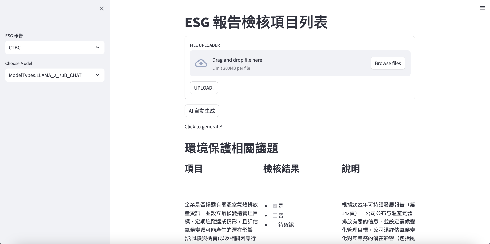
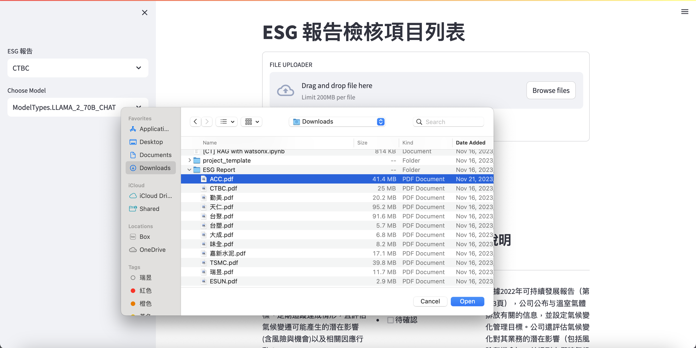
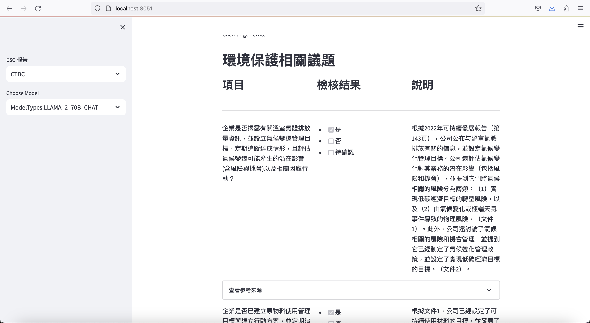

# watsonx-esg-validator

## Setup

`docker build . -t <YOUR IMAGE PREFER NAME>`

`docker run -it -d -v <this repo>:/app -p 8501:8501 <YOUR IMAGE PREFER NAME>`

## Open Browser 

1. Enter localhost:8501 in any preferred browser.

1. Upload your ESG Report

1. Check sidebar
2. Select Model, highly recommend llama2-70b-chat for Chinese Data
3. Click “自動生成”!
