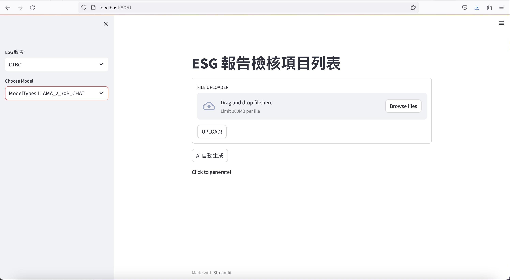

# watsonx-esg-validator

## Setup

`docker build . -t <YOUR IMAGE PREFER NAME>`

`docker run -it -d -v <this repo>:/app -p 8501:8501 <YOUR IMAGE PREFER NAME>`

## Open Browser 

1. Enter localhost:8501 in any preferred browser.

2. Upload your ESG Report. Avoid Chinese File Name, because the collection name in Chroma only allowed english charaters and numbers.

3. Check sidebar to see if your ESG report is showed.
4. Select Model, highly recommend llama2-70b-chat for Chinese Data
5. Click “自動生成”!
